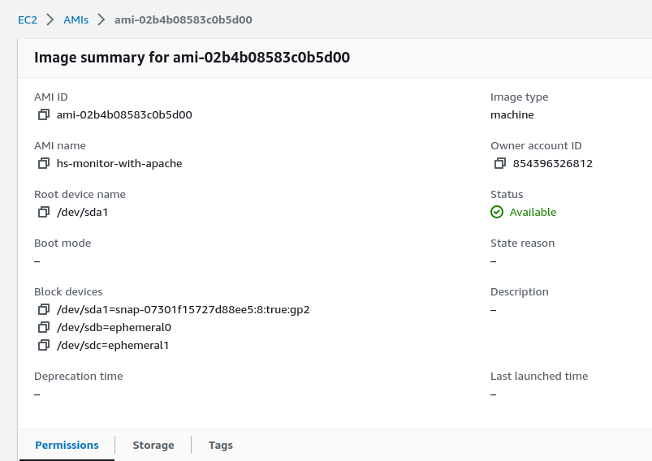

```
- ST0263, Project 2
Students:
- Sebastian Pulido Gomez, spulido1@eafit.edu.co
- Danilo De Jesus Toro Echeverri, djtoroe@eafit.edu.co

Professor:
- Edwin Nelson Montoya Munera, emontoya@eafit.edu.co
```

# Autosaling project

## 1) Description

### 1.1) Accomplished requirements

Our autoscaling implementation has the following accomplishments:

- A system with a monitor server.
- A system with a monitor client.
- A monitor server that receives metrics from monitor clients via gRPC.
- A monitor client that sends metrics to monitor server via gRPC.
- A monitor client that simulates metrics via a poison distribution.
- A monitor server that can create EC2 instances equipped with a monitor client and a configuration file.
- A monitor server that can send ICMP PING requests to launched instances to check their presence.
- A monitor server that can relaunch dead instances if necessary.
- A monitor server that can scale instances up or down depending on policies such as http-load or cpu-load.
- A monitor server with multiple configurable parameters via a config file.


## 2) Architecture


This diagram depicts three main components in our system:

- *Monitor service (green box)*: It's main function is to receive metrics from monitor clients which are used to determine
  whether the service should be scaled up (running more instances) or down (terminating some instances). Metrics are received
  via gRPC and storage in a [Sqlite](https://www.sqlite.org/fileformat.html) file where each one of the created instances
  is associated with a record of metrics. The monitor service also dispatches ICMP PING requests to determine whether an
  instance is alive or not. The timeout, count and frequency of PINGs is configurable. If an instance is determined to be
  dead, a new one will be relaunched only if the current count is less than the minimum quota specified in the configuration.
  Finally, the AWS module in the monitor server is capable of launching the new instance together with a script that is
  lunched when the instance is booted. This way, every instance is initialized with a proper configuration file that has
  all of the necessary information for the client monitor to reach the server.
- *Monitor client (red box)*: It's only function is to send metric to the monitor server via gRPC. There are two types of
  metrics, namely, http-load and cpu-load and both range from 0 to 100. Both types of metrics are simulated via a Poisson
  distrbution in order to prevent abrupt changes.
- *AWS cloud (blue box)*: It's the cloud where our autoscaling system operates. The monitor server is capable of running and
  terminating instances via the AWS API and proper credentials that are provided in the configuration file.

## 3) Development environment

### 3.1) Operating system

This lab project was developed and tested in Ubuntu 22.04.

### 3.2) Programming languages

*Monitor service*

The monitor service was implemented with the [Haskell](https://www.haskell.org) programming language with compiler `ghc-8.10.7`.
All of the dependencies together with their versions are specified in the [package.yaml](hsAutoscaling/package.yaml) file
in the `hsAutoscaling` subproject.

*Monitor client*

The monitor client was implemented with the [Haskell](https://www.haskell.org) programming language with compiler `ghc-8.10.7`.
All of the dependencies together with their versions are specified in the [package.yaml](hsMonitor/package.yaml) file
in the `hsMonitor` subproject.

### 3.3) Dir tree

```
hscaling
├── build-release.sh
├── first-time-install.sh
├── hsAutoscaling
│   ├── app
│   │   └── Main.hs
│   ├── asg-config.yaml
│   ├── CHANGELOG.md
│   ├── db
│   │   ├── create-db.sh
│   │   └── schema.sqlite
│   ├── gen-buffs.sh
│   ├── hsAutoscaling.cabal
│   ├── LICENSE
│   ├── package.yaml
│   ├── README.md
│   ├── Setup.hs
│   ├── src
│   │   ├── AutoScalingGroup
│   │   │   ├── App.hs
│   │   │   ├── AWS.hs
│   │   │   ├── CRUD.hs
│   │   │   ├── Env.hs
│   │   │   ├── Ping.hs
│   │   │   └── Scaling.hs
│   │   └── Grpc
│   │       ├── Protobuf
│   │       │   └── Monitor.hs
│   │       └── Server.hs
│   ├── stack.yaml
│   ├── stack.yaml.lock
│   └── test
│       └── Spec.hs
├── hsMonitor
│   ├── app
│   │   └── Main.hs
│   ├── CHANGELOG.md
│   ├── gen-buffs.sh
│   ├── hsMonitor.cabal
│   ├── LICENSE
│   ├── package.yaml
│   ├── README.md
│   ├── Setup.hs
│   ├── src
│   │   ├── Env.hs
│   │   ├── Grpc
│   │   │   ├── Client.hs
│   │   │   └── Protobuf
│   │   │       └── Monitor.hs
│   │   └── MetricGen.hs
│   ├── stack.yaml
│   ├── stack.yaml.lock
│   └── test
│       └── Spec.hs
├── protos
│   └── grpc
│       └── protobuf
│           └── monitor.proto
├── README.md
└── style.sh
```


### 3.4) Build process

#### 3.4.1) Build process

To install the dependencies necessary to build and work on this project execute the [first-time-install.sh](./first-time-install.sh)
script at the root of this repository:

```
./first-time-install.sh
```

#### 3.4.2) Sqlite db

To create an sqlite database compatible with this project, run the [hsAutoscaling/db/create-db.sh](./hsAutoscaling/db/create-db.sh)
script at `hsAutoscaling/db`. The script receives the name of the file:

```
cd hsAutoscaling/db
./create-db.sh monitor.db
```

#### 3.4.3) hsAutoscaling

`hsAutoscaling` is the project where the monitor service and autoscaling group is implemented. All of its dependencies
are managed with the cargo tool already installed with `first-time-install.sh`.

To build the project run

```
cd hsAutoscaling
stack build
```

To run the project:

```
stack run -- -c asg-config.yaml
```

where `asg-config.yaml` is an example configuration file for development which you can modify as needed:


```
grpcHost: 127.0.0.1
grpcPort: 50051
minInstances: 2
maxInstances: 5
balancingFrequencySecs: 20
dbPath: ./db/test-monitor.db
httpMaxLoadPercentage: 70
cpuMaxLoadPercentage: 70
monitorOpts:
  asgServerHost: 127.0.0.1
  asgServerPort: 50051
  samplingLambda: 5.5
  pushFrequencySecs: 10
pingOpts:
  responseTimeoutSecs: 3
  responseCount: 3
  pingFrequencySecs: 2
  pingIgnoreSpanSecs: 120
awsOpts:
  awsRegion: us-east-1
  accessKey: xxxx
  secretKey: xxxx
  sessionToken: xxxx
  ec2Opts:
    amiId: ami-0557a15b87f6559cf
    securityGroups:
    - "sg-02b81e14efea62542"
    - "sg-060f019b80316c35a"
    - "sg-09d74eb949ad0da22"
    instanceType: T2_Small
    namePrefix: gobbledygook
    keypair: vockey
    subnetId: subnet-05c67d31dd4cfee18
logLevel: Info
```

where,

1. `grpcHost`: The IP address or hostname where the gRPC server is running.
2. `grpcPort`: The port number on which the gRPC server is listening. Here, it is set to `50051`.
3. `minInstances`: The minimum number of instances that should be running in the autoscaling service. It is set to `2`,
    meaning that there should always be at least one instance running.
4. `maxInstances`: The maximum number of instances that the autoscaling service can scale up to. It is set to `5`, meaning
    that the service will not create more than five instances.
5. `balancingFrequencySecs`: The interval in seconds at which the autoscaling service checks instances for scaling. It is set to `20`,
    indicating that load balancing will be performed every 20 seconds.
6. `dbPath`: The SQLITE file path where the autoscaling service's test-monitor database is located
7. `httpMaxLoadPercentage`: The maximum load percentage threshold for HTTP-based metrics. If the load exceeds this threshold,
                            it may trigger autoscaling actions. Here, it is set to `70`.
8. `cpuMaxLoadPercentage`: The maximum load percentage threshold for CPU-based metrics. If the CPU load exceeds this threshold,
                           it may trigger autoscaling actions. It is also set to `70`.
9. `monitorOpts`: Additional options for the client's monitoring functionality. It includes the following sub-fields:
   - `asgServerHost`: The IP address or hostname of the autoscaling server. In this case, it is set to `127.0.0.1`.
   - `asgServerPort`: The port number on which the autoscaling server is listening. Here, it is set to `50051`.
   - `samplingLambda`: A lambda value used for simulating the metrics on the client side. It is set to `5.5`.
   - `pushFrequencySecs`: The frequency in seconds at which monitoring data is pushed to the autoscaling server. It is set to `10`.
10. `pingOpts`: Options related to pinging functionality for health checks. It includes the following sub-fields:
    - `responseTimeoutSecs`: The maximum time in seconds to wait for a response from a health check ping. It is set to `3`.
    - `responseCount`: The number of consecutive successful responses required to consider an instance healthy. It is set to `3`.
    - `pingFrequencySecs`: The interval in seconds at which health check pings are sent. It is set to `2`.
    - `pingIgnoreSpanSecs`: A span of time in seconds during which health check pings are ignored. It is set to `120`.
11. `awsOpts`: Options related to Amazon Web Services (AWS) functionality. It includes the following sub-fields:
   - `awsRegion`: The AWS region where the autoscaling service operates. Here, it is set to `us-east-1`.
   - `accessKey`: The access key used for authenticating with AWS services. The actual key is masked with "xxxx".
   - `secretKey`: The secret key associated with the access key for authentication. The actual key is masked with "xxxx".
   - `sessionToken`: An optional session token for temporary credentials. The actual token is masked with "xxxx".
   - `ec2Opts`: Additional options for the EC2 instances created by the autoscaling service. It includes the following sub-fields:
     - `amiId`: The ID of the Amazon Machine Image (AMI) used for launching EC2 instances. Here, it is set to `ami-0557a15b87f6559cf`.
     - `securityGroups`: A list of security group IDs associated with the EC2 instances. Here, it includes three security group IDs.
     - `instanceType`: The type of EC2 instance to launch. In this case, it is set to `T2_Small`.
     - `namePrefix`: A prefix used for the name of the EC2 instances created by the autoscaling service. It is set to `gobbledygook`.
     - `keypair`: The name of the key pair used for SSH authentication to the EC2 instances. Here, it is set to `vockey`.
     - `subnetId`: The ID of the subnet where the EC2 instances are launched. It is set to `subnet-05c67d31dd4cfee18`.
10. `logLevel`: The log level for the autoscaling service. It is set to `Debug`, indicating that detailed debug logs will be generated.


### 3.5) Build process

### 3.5.1) Protocol buffers

At the root of this repository there is a file named [hscaling/protos/grpc/protobuf](hscaling/protos/grpc/protobuf) where the
gRPC communication protocol has been defined. There is only one remote call procedure:

```
syntax = "proto3";
package monitor;

service MonitorService {
  rpc PushMetrics (PushMetricsRequest) returns (PushMetricsOkResponse) {}
}

message PushMetricsRequest {
  float cpu_load = 1;
  float http_load = 2;
  string private_dns_name = 3;
}
```

The protobuf file defines a monitoring service with a single method called "PushMetrics". The method expects a request message of
type "PushMetricsRequest" containing information about CPU load, HTTP load, and a private DNS name. The response message type, "PushMetricsOkResponse",
is not defined in the provided protobuf file.

This file is compiled with the [gen-buff.sh](https://github.com/sebashack/hscaling/blob/main/hsMonitor/gen-buffs.sh) script
that uses the [proto3-suite](https://hackage.haskell.org/package/proto3-suite) Haskell library.


### 3.5.2) Monitor client

The monitor client implements gRPC endpoints for the proto-file explained above at [src/Grpc/Client](https://github.com/sebashack/hscaling/blob/main/hsMonitor/src/Grpc/Client.hs).
On the other hand, it uses a Poisson distribution to simulate both the http and cpu loads at [src/MetricGen.hs](https://github.com/sebashack/hscaling/blob/main/hsMonitor/src/MetricGen.hs). Finally, it's [entrypoint](https://github.com/sebashack/hscaling/blob/main/hsMonitor/app/Main.hs) is just a function that
continuously samples the Poisson distribution and send them to the monitor server via gRPC.

Let's notice that the monitor client assumes that its configuration file is at `/opt/monitor_config.json`: [src/Env.hs](https://github.com/sebashack/hscaling/blob/main/hsMonitor/src/Env.hs#L36). That is because the monitor server produces a launch script that is executed when a monitor instance is initialized.
this configuration file looks like the following:

```
{"samplingLambda":9,"pushFrequencySecs":15,"asgServerHost":"172.31.90.116","asgServerPort":50051}

```

where,

1. `samplingLambda`: it's value that sets the average cases for out Poisson distribution.

2. `pushFrequencySecs`: The It represents the frequency in seconds at which the monitor client sends metrics to the autoscaling server.

3. `asgServerHost`: It represents the hostname or IP address of the autoscaling server that the monitor client interacts with.

4. `"asgServerPort`: It represents the port of the autoscaling server that the monitor client interacts with.


### 3.5.3) Monitor service

The monitor service has five main modules, namely, `Grcp/Server.hs`, `src/AutoScalingGroup/AWS.hs`,  `src/AutoScalingGroup/CRUD.hs`,
`src/AutoScalingGroup/Ping.hs`, and `src/AutoScalingGroup/Scaling.hs`.

*Grcp/Server.hs*

It's basically the implementation of the gRPC [server](https://github.com/sebashack/hscaling/blob/main/hsAutoscaling/src/Grpc/Server.hs)
for the protocol buffer described in section `3.5.1`.


*src/AutoScalingGroup/AWS.hs*

The [AWS.hs](https://github.com/sebashack/hscaling/blob/main/hsAutoscaling/src/AutoScalingGroup/AWS.hs) module implements
the two functions that interact with the AWS cloud, namely, `runInstance` and `terminateInstance`. These functions were
implemented with the [amazonka-ec2](https://hackage.haskell.org/package/amazonka-ec2) Haskell SDK. `runInstance` receives
all of the parameters to create the instance--namely, instance type, image id, security groups, etc.--and dispatches a
request to AWS. It's important to note that we are also providing the `risUserData` property that allows users to specify
an script that is executed when the instance is initialized. In our case we have mounted an script like the following:

```
#!/bin/bash
rm -f /opt/monitor_config.json\necho '<json-conf>' > /opt/monitor_config.json
```

where `<json-conf>` is generated dynamically and has all of the information necessary for the monitor client to send requests
to the monitor and adjust its data sampling. For example:


```
{"samplingLambda":9,"pushFrequencySecs":15,"asgServerHost":"172.31.90.116","asgServerPort":50051}

```

where the fields have already been explained in the previous section.

`terminateInstance` terminates an instances given an instance-id.


*src/AutoScalingGroup/CRUD.hs*

The [CRUD.hs](https://github.com/sebashack/hscaling/blob/main/hsAutoscaling/src/AutoScalingGroup/CRUD.hs) module implements
the operations for inserting and querying instances and metrics in the Sqlite database whose schema is as follows:


```
CREATE TABLE instance (
    id                TEXT PRIMARY KEY,
    private_ip        TEXT NOT NULL,
    private_dns_name  TEXT NOT NULL,
    created_at        DATETIME,
    UNIQUE(private_ip),
    UNIQUE(private_dns_name)
);

CREATE TABLE metric (
    id                   INTEGER PRIMARY KEY AUTOINCREMENT,
    instance_id          TEXT NOT NULL,
    cpu_load_percentage  REAL NOT NULL,
    http_load_percentage REAL NOT NULL,
    created_at           DATETIME,
    CONSTRAINT fk_metric_instance FOREIGN KEY(instance_id) REFERENCES instance(id) ON DELETE CASCADE
);
```

*src/AutoScalingGroup/Ping.hs*

The [Ping.hs](https://github.com/sebashack/hscaling/blob/main/hsAutoscaling/src/AutoScalingGroup/Ping.hs) module implements the
actions for the thread that checks whether instances are alive, and based on the current instance count it determines
whether it should relaunched dead instances if there are less than the minimum quota specified in the configuration file. This module
uses the ICMP PING protocol via a unix system call.

*src/AutoScalingGroup/Scaling.hs*

The [Scaling.hs](https://github.com/sebashack/hscaling/blob/main/hsAutoscaling/src/AutoScalingGroup/Scaling.hs) module implements
the main actions for the thread that checks current group capacity and determines whether the cluster should scale up or down.
There are two policies for scaling, namely, `http-load` and `cpu-load`. They can be applied separately or combined. This module
checks the average load of all instances that have pushed metrics at a given point in time, and after evaluating the policy,
it decides if the scaling should go up or down (or should not go at all).


## 4) Deployment

This project was deployed on the AWS cloud. First, a [github release](https://github.com/sebashack/hscaling/releases/tag/v0.0.2) with our system binaries was created:


Then a monitor client instance was launched and the `hsmonitor` was installed together with `apache2` server. A service file
was also implemented for it:

```
[Unit]
Description=Monitor client service

[Service]
User=root
WorkingDirectory=/opt/asg
ExecStart=/opt/asg/hsmonitor
Restart=always
RestartSec=5

[Install]
WantedBy=multi-user.target

```

Once we verified that the monitor was working well and sending metrics to the server, we created an `ami` out of it:




The monitor server was also deployed on a ec2 instance and the configuration file was properly set for this production
environment. The `ami` above was used in the config:


After deployment we checked that Apache was serving the example web page:


## 5) References

- https://hackage.haskell.org/package/proto3-suite
- https://hackage.haskell.org/package/amazonka-ec2
- https://hackage.haskell.org/package/grpc-haskell
- https://hackage.haskell.org/package/statistics-0.16.2.0/docs/Statistics-Distribution-Poisson.html
